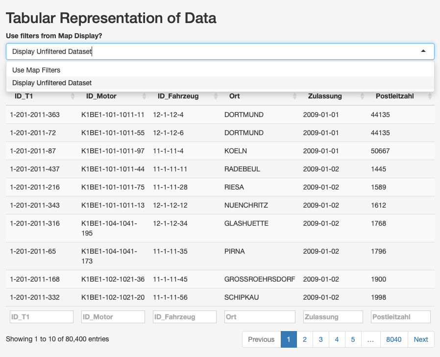

# Introduction
This document contains the documentation of the data analysis process for the component T01 from the company "201". The aim of the analysis was to identify all defective components and which engines and cars they are part of. The data analysis process includes the import of the data, the cleaning up of the data, the transformation of the data to obtain the relevant information and the development of a shiny app to communicate the results.

The following packages were used to perform the data analysis.

```{r, eval = FALSE}
#Add the packages which are used during the analysis
install.packages("tidyverse")
install.packages("lubridate")
install.packages("rmarkdown")
install.packages("knitr")
install.packages("shiny")
install.packages("shinyWidgets")
install.packages("leaflet")
install.packages("leaflet.extras")
```

```{r, message = FALSE, warning = FALSE}
library(tidyverse)
library(lubridate)
library(rmarkdown)
library(knitr)
library(shiny)
library(shinyWidgets)
library(leaflet)
library(leaflet.extras)
```
# Import Data
The task was to identify all engines and cars which contains a defective component and to inform the affected customers and OEMs about it. Based on the task and the information given it was decided which datasets are relevant for the data analysis. The component "T01" is a standard component of the car brands "OEM1" and "OEM2". Because of that every car of those two manufacturers and every engine which they use contains the component. Which engines are a component of which car brand can be found in the following table:

```{r, echo = FALSE, results ='asis'}
library(knitr)
table1 <- data.frame(c("Gasoline_Engines_K1BE1", "Diesel_Engine_K1DI1"), c("Gasoline_Engines_K1BE1", "Diesel_Engine_K1DI1"))
colnames(table1) <- c("Engine_OEM1", "Engine_OEM2")
kable(table1, caption = "Engine of the cars")
```

Based on this information the relevant component, engine and car data frames were imported. The relevant data includes the component T01, the cars from OEM1 and OEM2 and the engines inside those cars. To connect the datasets of the cars, engines and components, the datasets describing the relationship between these parts were also imported. Furthermore, we also need the locations where the cars were registered. The task is to inform the customer about defective products. Based on that the datasets related to the registration and the geographical data were imported. The geodata was imported specifically for the visualization of the data later on. In the following table, you can find all the data frames imported for the analysis:

```{r, echo = FALSE, results = 'asis'}


a <- c("Einzelteil_T01.txt", "Fahrzeuge_OEM1_Typ11.csv", "Fahrzeuge_OEM1_Typ12.csv","Fahrzeuge_OEM2_Typ21.csv","Fahrzeuge_OEM2_Typ22.csv","Komponente_K1BE1.csv", "Komponente_K1BE2.csv", "Komponente_K1DI1.csv","Komponente_K1DI2.txt")

b <- c("Bestandteile_Komponente_K1BE1.csv","Bestandteile_Komponente_K1BE2.csv","Bestandteile_Komponente_K1DI1.csv","Bestandteile_Komponente_K1DI2.csv", "Bestandteile_Komponente_OEM1_Typ11.csv","Bestandteile_Komponente_OEM1_Typ12.csv","Bestandteile_Komponente_OEM2_Typ21.csv","Bestandteile_Komponente_OEM2_Typ22.csv", "")

c <- c("Geodaten_Gemeinden_v1.2_2017-08-22_TrR.csv", "Zulassungen_alle_Fahrzeuge.csv", " ", " ", " ", " ", " ", " "," ")

import <- cbind(a,b,c)
colnames(import) <- c("component, Engine, Cars", "Relation Tables", "Location Related")
kable(import, caption = "Imported Data")

```

## How to import the data?
The files were imported with functions from the `readr` - package. Depending on the delimiter the CSV-files were either imported with the function read_csv() (delimiter: ",") or read_csv2() (delimiter: ";"). An exception is the datasets for the engines K1DI1 and K1DI2 and the component T01. They were imported with the functions of the `Utils` - package. Importing them with the functions of the `readr` package would have lead to parsing errors because the data was split into three different parts of the table (T01, K1DI1) or the name of the columns would have been wrong (K1DI2). They were turned to the class `tibble` to have a consistent class for all the datasets. Also for the import of the datasets of T01 and the engine K1DI2 some extra steps needed to be done. This steps can be found below the following code.

```{r, results = 'hide', message= FALSE, warning = FALSE}
#Import of all relevant files related to components, engines and cars
oem1_11 <- read_csv("Data/Fahrzeug/Fahrzeuge_OEM1_Typ11.csv")
oem1_12 <- read_csv2("Data/Fahrzeug/Fahrzeuge_OEM1_Typ12.csv")
oem2_21 <- read_csv("Data/Fahrzeug/Fahrzeuge_OEM2_Typ21.csv")
oem2_22 <- read_csv2("Data/Fahrzeug/Fahrzeuge_OEM2_Typ22.csv")

k1be1 <- read_csv("Data/Komponente/Komponente_K1BE1.csv")
k1be2 <- read_csv2("Data/Komponente/Komponente_K1BE2.csv")

#Importing with the utils package because with the readr package we would have a parsing error and a lot of data is shown as NA even though there is data. The parsing error happens because the data is split in different columns
k1di1 <- as.tibble(read.csv("Data/Komponente/Komponente_K1DI1.csv", stringsAsFactors = FALSE))
  
#Import of the relation tables
relation_oem1_11 <- read_csv2("Data/Fahrzeug/Bestandteile_Fahrzeuge_OEM1_Typ11.csv")
relation_oem1_12 <- read_csv2("Data/Fahrzeug/Bestandteile_Fahrzeuge_OEM1_Typ12.csv")
relation_oem2_21 <- read_csv2("Data/Fahrzeug/Bestandteile_Fahrzeuge_OEM2_Typ21.csv")
relation_oem2_22 <- read_csv2("Data/Fahrzeug/Bestandteile_Fahrzeuge_OEM2_Typ22.csv")
  
relation_k1be1 <- read_csv2("Data/Komponente/Bestandteile_Komponente_K1BE1.csv")
relation_k1be2 <- read_csv2("Data/Komponente/Bestandteile_Komponente_K1BE2.csv")
relation_k1di1 <- read_csv2("Data/Komponente/Bestandteile_Komponente_K1DI1.csv")
relation_k1di2 <- read_csv2("Data/Komponente/Bestandteile_Komponente_K1DI2.csv")
  
#Import of the location related files
zulassung <- read_csv2("Data/Zulassungen/Zulassungen_alle_Fahrzeuge.csv")
geodata <- read_csv2("Data/Geodaten/Geodaten_Gemeinden_v1.2_2017-08-22_TrR.csv")
```

The files "Einzelteil_T01.txt" and "Komponente_K1DI2.txt" couldn't be imported immediately with the above-described functions. The delimiter in both files was not common, which made the immediate import not possible. To overcome this problem the files were first read into R as a string. Afterward, the delimiter for a new line and the delimiter for a new cell were replaced with more common delimiter. Afterward, the file was saved as a CSV-document and imported with the corresponding function. The code for both can be seen below:

```{r, results = 'hide', message= FALSE, warning = FALSE}
#Import the component K1DI2
#Read the file as String
k1di2_string <- read_file("Data/Komponente/Komponente_K1DI2.txt")
  
#replace the delimter with more common delimiter and save the document as csv-file in the directory
k1di2_csv <- gsub("\\\\", ";", k1di2_string)
k1di2_csv <- paste("\"\"," , k1di2_csv, sep = "")
k1di2_csv <- gsub("\t", "\n", k1di2_csv)
write(k1di2_csv, file = "Data/Komponente/Komponente_K1DI2.csv")
  
#import the saved csv-file
k1di2 <- as.tibble(read.csv2("Data/Komponente/Komponente_K1DI2.csv", stringsAsFactors = FALSE))
k1di2_string <- ""
k1di2_csv <- ""
gc()
#Import the component T01
#Read the file as String
t01_string <- read_file("Data/Einzelteil/Einzelteil_T01.txt")
  
#replace the delimter with more common delimiter and save the document as csv-file in the directory
t01_csv <- gsub(" \\| \\| ", ",", t01_string)
t01_csv <- paste("\"\"," , t01_csv, sep = "")
t01_csv <- gsub(" ", "\n", t01_csv)
write(t01_csv, file = "Data/Einzelteil/Einzelteil_T01.csv")
  
#import the saved csv-file
#Import it with the utils package because with the readr package we would have a parsing error and a lot of data is shown as NA even though there is data. The parsing error happens because the data is split on different columns
t01 <- as.tibble(read.csv("Data/Einzelteil/Einzelteil_T01.csv", stringsAsFactors = FALSE))
t01_string <- ""
gc()
```
# Tidy Data
After importing the files the data frames needed to be clean up to have them in a form which is usable. The data frames should fulfill the following requirements: 

- Every column contains a variable
- Each row contains an observation
- Each cell contains a value

To clean up the data, the name of the columns were fixed where needed, and the class of the columns was checked and changed where needed.
Columns and rows not containing data were deleted. Also, columns were combined to showcase the data which was intended to be in the same column. In the following, you can see the details of what was done for each dataset. To get an overview of the dataset, the following commands were used:

- str(): To see the general structure of the dataset and to observe the class of the different columns but also from the dataset in general
- summary(): To identify what data was inside each column and if we can see empty rows, cells, and columns
- head(): To observe the head of the dataset and have a first glimpse of how the data is filled in the beginning
- tail (): To observe the end of the dataset and have an idea if and how the end of a dataset is filled with data.

You can find in the following a detailed overview of the clean up of the datasets and what was done. Even though not all the columns might be relevant for the shiny app, later on, everything was cleaned up. The idea behind it was, that in case we notice something which we thought was not relevant in the data will be later on relevant we don't need to clean it up then.

## Datasets related to components, components or cars

### Cleanup of the T01 dataset

The dataset had duplicated columns. Each duplicate contained a different part of the data. The first part is shown normally starting in the first column. The second part starts in the column ID_T01.y and the third part starts in the column ID_T01. The data needed to be combined in one column. 
The class of the production date "Produktionsdatum" and date of the defect "Fehlerhaft_Datum" were not in a date format. They needed to be changed to the date format. Furthermore, the column names were changed to separate them from similar columns in the cars and engines datasets. Furthermore, all not needed columns like empty columns or columns which show the count of the observation were removed. The code can be found below:

```{r, results = 'hide'}

#Split the three different parts into three different datasets
t01_part1 <- filter(t01, !is.na(ID_T01.x)) 
t01_part2 <- filter(t01, !is.na(ID_T01.y))
t01_part3 <- filter(t01, !is.na(ID_T01))
#remove the empty and not needed columns for each dataset
t01_part1 <- t01_part1[, c(-1:-2, -10:-23)] 
t01_part2 <- t01_part2[, c(-1:-9, -17:-23)]
t01_part3 <- t01_part3[, c(-1:-16)]
#give the column the same name  so we can bind them again. Give them a T1 ending to seperate when joining the columns from similar ones related to cars or components
colnames(t01_part3) <- c("ID_T1", "Produktionsdatum_T1", "Hersteller_T1","Werksnummer_T1", "Fehlerhaft_T1", "Fehlerhaft_Datum_T1", "Fehlerhaft_Fahrleistung_T1" )
colnames(t01_part2) <- colnames(t01_part3)
colnames(t01_part1) <- colnames(t01_part3)
#Connect the three datasets to one dataset
t01_clean <- rbind(t01_part1, t01_part2, t01_part3)
#turn Produktionsdatum and Fehlerhaft_Datum into date class
t01_clean$Produktionsdatum_T1 <- as.Date(t01_clean$Produktionsdatum_T1, format = "%Y-%m-%d")
t01_clean$Fehlerhaft_Datum_T1 <- as.Date(t01_clean$Fehlerhaft_Datum_T1, format = "%Y-%m-%d")

```

### Cleanup of the engines datasets

Each of the datasets related to the engines had different problems to solve through a cleanup. 

- **K1BE1**: In this dataset, the production date was shown as the number of days in the column "Produktionsdatum_Origin_01011970" with the origin date (01-01-1970) as the basis. Furthermore, we needed to turn the class of the "origin" column into a date format to calculate with its help the production date in a date format of the respective observation.
- **K1BE2**: This dataset had very similar matters to clean up like the K1BE1 dataset.
- **K1DI1**: The data was separated into different columns. The first part was shown normally starting in the first column. The second part started in the column "ID_Motor.y" and the third part starts in the column "ID_Motor". The different parts needed to be connected to the same columns. The class of the production date ("Produktionsdatum") and date of the defect ("Fehlerhaft_Datum") were not in date format and needed to be transformed into it. The column with the information about the engine manufacturer number ("Herstellernummer") was wrong. By comparing the manufacturer number with the ID we noticed that the number of the manufacturer doesn't match the part showing the manufacturer in the ID number. With the help of the ID number we could replace this column with the correct data.
- **K1DI2**: The class of the "origin" column and date of the defect ("Fehlerhaft_Datum") were not in a date format. The production date ("Produktionsdatum_Origin_01011970") was shown as the number of days with the "origin" column containing the date 01-01-1970 as the basis. We needed to calculate the production date with these two columns.

In all engine datasets, the names were modified to separate them clearly from similar column names of the cars and component datasets when joining them. Also here we removed the first column showing the count of the observation and other not relevant columns like the columns "origins" and "Produktionsdatum_Origin_01011970" after creating a column for the production date in date format. To clean up the dataset we used the following code:

```{r, results = 'hide'}
#K1BE1

# removed the first two columns, which just contains the counting of the dataset
k1be1_clean <- k1be1[, -1:-2] 
#change origin column in to the class date
k1be1_clean$origin <- as.Date(k1be1_clean$origin, format = "%d-%m-%Y")
#Create the "Produktionsdatum" column by adding the number in the column "Produktionsdatum_Origin_01011970"  to the Origin date
k1be1_clean <- mutate(k1be1_clean, Produktionsdatum= origin + Produktionsdatum_Origin_01011970) 
#Remove the not needed columns "Produktionsdatum_Origin_01011970" and "Origin"
k1be1_clean <-  k1be1_clean[, -7:-8]
#Change the name of the columns of the dataset to clearly seperate them from the others when joining them
colnames(k1be1_clean)[2:7] <- paste(colnames(k1be1_clean)[2:7],"Motor", sep ="_")
  
#K1BE2

#remove first two columns which shows the count of the row
k1be2_clean <- k1be2[, -1:-2] 
#turn the Origin column in the class date and into the format Year-Month-Day
k1be2_clean$origin <- strptime(k1be2_clean$origin, format = "%d-%m-%Y")
k1be2_clean$origin <-  ymd(k1be2_clean$origin)
#Create the production date column by adding the number of days to the origin date
k1be2_clean <- mutate(k1be2_clean, Produktionsdatum= origin + Produktionsdatum_Origin_01011970) 
#Remove the not needed columns "Produktionsdatum_Origin_01011970" and "Origin"
k1be2_clean <-  k1be2_clean[, -7:-8]
#Change the name of the columns of the dataset to clearly seperate them from the others when joining them
colnames(k1be2_clean)[2:7] <- paste(colnames(k1be2_clean)[2:7],"Motor", sep ="_")

#K1DI1

#seperate the dataset into three parts
k1di1_part1 <- filter(k1di1, !is.na(ID_Motor.x)) 
k1di1_part2 <- filter(k1di1, !is.na(ID_Motor.y))
k1di1_part3 <- filter(k1di1, !is.na(ID_Motor))
#remove the empty and not needed columns for each part
k1di1_part1 <- k1di1_part1[, c(-1:-2, -10:-23)] 
k1di1_part2 <- k1di1_part2[, c(-1:-9, -17:-23)]
k1di1_part3 <- k1di1_part3[, c(-1:-16)]
#give the column the same name based on the column names of k1di1_part3 so we can bind them again.
colnames(k1di1_part2) <- colnames(k1di1_part3)
colnames(k1di1_part1) <- colnames(k1di1_part3)
#connect all the parts to one again
k1di1_clean <- rbind(k1di1_part1, k1di1_part2, k1di1_part3)
#turn Produktionsdatum and Fehlerhaft_Datum into date class
k1di1_clean$Produktionsdatum <- as.Date(k1di1_clean$Produktionsdatum, format = "%Y-%m-%d")
k1di1_clean$Fehlerhaft_Datum <- as.Date(k1di1_clean$Fehlerhaft_Datum, format = "%Y-%m-%d")
#replace the Data in the column Werksnummer with the right data based on ID_Motor. The names of the replacement table needs to be different than the one inside the k1di1_clean dataset because on some computers it gives out an mistake if the names are the same.
replacement <- separate(k1di1_clean, "ID_Motor", c("Engine", "Hersteller", "Werk", "Nummer"), "-" )
k1di1_clean$Werksnummer <- as.numeric(replacement$Werk)
#change the name of the columns 2-7 to clearly seperate the engines from the other datasets when joining
colnames(k1di1_clean)[2:7] <- paste(colnames(k1di1_clean)[2:7],"Motor", sep ="_")


#K1DI2'

#Remove the first two columns with not needed information and give the columns the right names
k1di2_clean <- k1di2[, -1] 
#turn origin and Fehlerhaft_Datum into date class
k1di2_clean$origin <- as.Date(k1di2_clean$origin, format = "%d-%m-%Y")
k1di2_clean$Fehlerhaft_Datum <- as.Date(k1di2_clean$Fehlerhaft_Datum, format = "%Y-%m-%d")
#Create the production date column by adding the number of days to the origin date
k1di2_clean <- mutate(k1di2_clean, Produktionsdatum= origin + Produktionsdatum_Origin_01011970) 
k1di2_clean <- k1di2_clean[,-7:-8] 
#change the name of the columns 2-7 to clearly seperate the engines from the other datasets when joining
colnames(k1di2_clean)[2:7] <- paste(colnames(k1di2_clean)[2:7],"Motor", sep ="_")
```

### Cleanup of the cars datasets

For all datasets, we removed all unnecessary columns. On the one side, this was the first column "x1" showing the count of the observation and on the other side, we removed the "origin" and "Produktionsdatum_Origin_01011970" after creating the column containing the production date (for datasets related to OEM 2). Furthermore, the column names were changed to separate them clearly from similar columns from other datasets when joining them.

For the two datasets from the OEM 2, the class of the column "origin" was not in a date format and needed to be transformed into it. Furthermore, the production date was shown as the number of days from the origin date 01-01-1970 inside the column "Produktionsdatum_Origin_01011970". The production date in a date format needed to be calculated.

For the datasets of the OEM 1 nothing more than above was identified to perform a cleanup.

```{r, results = 'hide'}

#OEM: The datasets relating to the cars had similar problems. The format of the date related columns were not always correct and the productiondate needed to be calculated out of two columns

oem1_11_clean <- oem1_11
oem1_12_clean <- oem1_12
oem2_21_clean <- oem2_21
oem2_22_clean <- oem2_22

#Change class of origin column to class date
oem2_21_clean$origin <- as.Date(oem2_21_clean$origin, format = "%d-%m-%Y")
oem2_22_clean$origin <- as.Date(oem2_22_clean$origin, format = "%d-%m-%Y")

#create the production data column
oem2_21_clean <- mutate(oem2_21_clean, Produktionsdatum= origin + Produktionsdatum_Origin_01011970)
oem2_22_clean <- mutate(oem2_22_clean, Produktionsdatum= origin + Produktionsdatum_Origin_01011970)

#Delete not needed columns
oem1_11_clean <- subset(oem1_11_clean, select = -c(X1, X1_1) )
oem1_12_clean <- subset(oem1_12_clean, select = -c(X1, X1_1) )
oem2_21_clean <- subset(oem2_21_clean, select = -c(X1, X1_1, Produktionsdatum_Origin_01011970, origin))
oem2_22_clean <- subset(oem2_22_clean, select = -c(X1, X1_1, Produktionsdatum_Origin_01011970, origin))

#change the names of the columns to make it unique comapred to other datasets
colnames(oem1_11_clean)[2:7] <- paste(colnames(oem1_11_clean)[2:7],"Fahrzeug", sep ="_")
colnames(oem1_12_clean)[2:7] <- paste(colnames(oem1_12_clean)[2:7],"Fahrzeug", sep ="_")
colnames(oem2_21_clean)[2:7] <- paste(colnames(oem2_21_clean)[2:7],"Fahrzeug", sep ="_")
colnames(oem2_22_clean)[2:7] <- paste(colnames(oem2_22_clean)[2:7],"Fahrzeug", sep ="_")

```

##Cleanup of the datasets related to relation tables

For the relation tables between cars and components nothing was identified which needed a cleanup. 
For the relation tables between engines and cars, the name of the column for the ID of the engine was changed. This was needed to join the different datasets later on by this column. For this, they need to have the same name.

```{r, results = 'hide'}
#Tidy up the relation tables for the engines and the components:
  
#Change the name for the engine ID column so it fits to the engine datasets
#Remove the column with the ID of the not needed components. We are just looking on the T01 part

colnames(relation_k1be1)[6] <- "ID_Motor"
colnames(relation_k1be2)[6] <- "ID_Motor"
colnames(relation_k1di1)[6] <- "ID_Motor"
colnames(relation_k1di2)[6] <- "ID_Motor"

#For the relation tables of the cars and engines a clean up was not needed

```
gc()
## Cleanup of the location related Datasets

For the location related dataset following was identified and done:

- **Geodata**: In the geodata, we noticed that an observation is missing. There was no data for the location "Seeg". For that, we needed to figure out the information regarding postcode, latitude, and longitude and added this information to the dataset. Furthermore, the not needed columns were removed and the columns were renamed when needed to join the data later like in the datasets before.
- **Zulassung**: Except for the change of column names and removing not needed columns nothing more was identified in need for a cleanup.

```{r, results = 'hide'}

#Zulassung: Remove the not needed column, fit the name of the ID column to the car dataset --> "ID_Fahrzeug"
zulassung_clean <- zulassung[, -1]
colnames(zulassung_clean)[1:2] <- c("ID_Fahrzeug", "Ort")


#Geodata: Remove the first two columns which are showing the count of the row. The data for the location "Seeg" is missing. The Postcode is 87637. The longitude = 10.612874 and the latitude = 47.654894. The location was added to the dataset
geodata_clean <- geodata[, -1:-2]
colnames(geodata_clean)[2] <- "Ort"

seeg <- data.frame(87637, "SEEG", 10.612874, 47.654894)
colnames(seeg) <- c("Postleitzahl", "Ort", "Laengengrad", "Breitengrad")
geodata_clean <- rbind(geodata_clean, seeg)


```

# Transform & Joining the Data
This part of the document will document the creation of the final dataset used to isolate and identify the relevant data for the shiny app. The datasets were reduced to the necessary data and then joined to create the final dataset.

## Transform the relation tables
Because we are only interested in the relation between the t01 component, the engines, and the cars all columns which contain the ID of other components or engines were removed from the relation tables. For the relation table for the engines and the T01 component, just the ID for both remained. The same was done for the relation tables between cars and engines. In this case, the ID number for cars and engines remained in the dataset.

```{r, results= 'hide'}
#transform the relation tables
relation_k1be1_analysis <- select(relation_k1be1, ID_Motor, ID_T1)
relation_k1be2_analysis <- select(relation_k1be2, ID_Motor, ID_T1)
relation_k1di1_analysis <- select(relation_k1di1, ID_Motor, ID_T1)
relation_k1di2_analysis <- select(relation_k1di2, ID_Motor, ID_T1)

relation_oem1_11_analysis <- relation_oem1_11[, -1:-4]
relation_oem1_12_analysis <- relation_oem1_12[, -1:-4]
relation_oem2_21_analysis <- relation_oem2_21[, -1:-4]
relation_oem2_22_analysis <- relation_oem2_22[, -1:-4]
```

## Transform and join the T01, Engine, Car, Relation Tables

Afterward, the separated datasets of the engines, cars and the respective relation tables were combined to reduce the work for joining the datasets together later on.

```{r, results = 'hide'}
engines <- rbind(k1be1_clean, k1be2_clean,k1di1_clean, k1di2_clean)
spare_engine <- rbind(relation_k1be1_analysis, relation_k1be2_analysis,relation_k1di1_analysis, relation_k1di2_analysis)
engine_car <- rbind(relation_oem1_11_analysis, relation_oem1_12_analysis, relation_oem2_21_analysis, relation_oem2_22_analysis)
cars <- rbind(oem1_11_clean, oem1_12_clean, oem2_21_clean, oem2_22_clean)
```

In the next step, the datasets were reduced to the relevant information. First of all the basics of the analysis are the defective T01 components of the company 201. The T01 data set was filtered regarding these two bits of information. For the datasets of the engines and the cars, we decided to keep only the column with the ID, which is necessary to join the datasets and the manufacturer number. This column is necessary for the shiny app, later on, to clearly attribute the defective cars to the respective engine manufacturers. The same was done for the dataset containing the cars. The columns showing if a car or an engine is defective were removed. When a component is defective also the component containing it is defective. The same goes for the relation between the component and the car. Concluding that a car containing a defective component is also defective.  Based on that the information about the defective components is enough to identify the defective engines and cars. Also, the rest of the removed columns don't give us relevant information regarding the task to isolate the defective cars and inform the car manufacturer and customers about them.

```{r, results = 'hide'}

#filter for the defective spar parts produced by company 201 and select the relevant informatiosnipn to inform the customers and OEMs
t01_analysis <- filter(t01_clean, Hersteller_T1 == 201 & Fehlerhaft_T1 == 1) %>%
  select(ID_T1, Hersteller_T1, Fehlerhaft_T1)

#remove all columns except of the ID and the manufacturer
engines_analysis <- select(engines, ID_Motor, Herstellernummer_Motor)
cars_analysis <- select(cars, ID_Fahrzeug, Herstellernummer_Fahrzeug)
```

## Joining the Data and reduce them to the needed information
The dataset which will be used was joined with the dataset for the component T01 as the basis. The following datasets were combined in the following order and by the following columns:

1. The dataset containing the defective T01 and the relation tables between the component and components were joined by the column "ID_Motor".
2. The next dataset which was joined was the dataset of the engines also by the column "ID_Motor".
3. Afterward, the relation tables between the cars and components were joined by the column "ID_Fahrzeug".
4. The next dataset which was joined was the cars dataset by the column "ID_Fahrzeug".
5. The next dataset which was joined afterward contained the information regarding the registration. The dataset was joined by the column "ID_Fahrzeug".
6. Last but not least the dataset containing the Geodata was joined by the column "Ort".

After joining the dataset together we filtered for all the defective cars which are also registered. We also removed the column "Fehlerhaft_T1" showing that a component is defective. The column was not needed anymore because all the components which were filtered until this point were defective. 

```{r, results = 'hide'}
#Joining the data with the defective T01 components as basis and filter for the cars with defective component which are registered
final <- left_join(t01_analysis, spare_engine, by  = "ID_T1") %>%
  left_join(., engines_analysis, by = "ID_Motor") %>%
  left_join(., engine_car, by = "ID_Motor") %>%
  left_join(., cars_analysis, by = "ID_Fahrzeug") %>%
  left_join(., zulassung_clean, by = "ID_Fahrzeug") %>%
  left_join(., geodata_clean, by = c("Ort")) %>%
  filter(!is.na(Zulassung))

#remove the column show casing that a T1 component is defect and the manufacturer of T1. It is not needed for the anaylisis later on
final <- subset(final, select = - c(Fehlerhaft_T1, Hersteller_T1) )
```

The final dataset has this structure:

```{r, results = 'asis', echo = FALSE}

kable(final[1:7, 1:5], caption = "Final Dataset Part 1")
kable(final[1:7, 6:10], caption = "Final Dataset Part 2")

```

With the final dataset we could identify the critical production amount. The amount of cars containing the defective spare part of company 201 is:
```{r, results = 'asis', echo = FALSE}
defective_cars <- summarise(final ,defective_cars = n())
kable(defective_cars, caption = "Amount of Defective Cars")

```

# Shiny App
Shiny is a technology from the R environment that transforms analyses into interactive web applications that can be disseminated online on a website or in the company intranet, for example. The development of the application takes place completely in R, no HTML or JavaScript knowledge is required. The deployment of Shiny applications takes place via the Shiny Server, which is available both as open source and enterprise version. The server manages the provision of apps and can be accessed via intranet and internet. One part describes the structure of the application and is usually abbreviated as UI. This section of the code defines the entire layout of the application with all possible interactions, i.e. widgets. The second component is the server: Here, all outputs created in the UI are defined with R code, which can access all input values. The application is saved as one file (app.R) or as two files (ui.R and server.R). 

Each user interface starts with the main function, which defines the website to be built for the application. This is a kind of basic framework for each application, which defines different options
As soon as the user interface is defined, all outputs created in this way can be defined in the server script using conventional R code. Conceptually, the server section of an application is a function whose parameters are all possible inputs and the labels of the outputs created. 

R-Studio then takes over the rendering of the front-end and you get a common HTML file, in whose backend R runs. The advantages of simplicity has, of course, its drawbacks. Shiny is rather limited in design and the placement of inputs like sliders, drop-downs or outputs like graphics or tables is very restricted.

With the dataset from before a shiny app was developed to communicate the results of the data. Two different plots were developed. The first one shows the development of the registration of the defective and registered cars over time in different areas. The second one is a heatmap which shows the concentration of the registered cars containing a defective T01 component.

## Registration over the time
The task was to isolate the defective cars and inform the manufacturer and customer about it. Based on that we developed a plot which shows the development of the registration over time. The registration is shown accumulated over the month to give a better overview of the development. The data would have been harder to analyze if the development of the registration would have been shown over each day. Furthermore, the plot shows the proportion of registered and defective cars/engines per manufacturer. This is important for the manufacturer using this plot to identify which defective cars belongs to their responsibility.

It was decided to show the data over with a bar plot because it is also easier to separate the data by the manufacturers. A line plot would have made the observation of how many defective and registered cars belong to which manufacturer harder. At the same time, it is also possible to evaluate the development in a bar plot.

The plot can be filtered in the following aspects with the following reason:

- **Car manufacturer or Engine manufacturer**: It is relevant which kind of manufacturer is looking at the data. If a car manufacturer is analyzing the plot and wants to see how many defective cars were registered, he is not interested which engine from which engine manufacturer is in the car but which cars belong to him. The same goes when an engine manufacturer is looking at the data.
- **Time Period**: In case there is a relevant time period to watch. For example, if it is identified that the problem of the T01 component started at a certain time it is easier for the person to just watch on the data from that period.
- **Location**: Some locations are more important to observe, especially the ones with the highest concentration of defective and registered cars. In combination with the heatmap, the manufacturer can just watch on the data of the location which have the highest amount of defective cars and with that are more important to be analyzed.
- **manufacturer Number**: If one manufacturer is looking on the plot he is more interested in the cars which belong to him. The data which shows which cars belong to another manufacturer might be irrelevant for him because these cars are not in his responsibility. With that option, he can just find the registered cars belonging to him. 

## Concentration of the defective and registered cars
The second part of the shiny app task involved visualizing the distribution of cars containing defective parts in such a way as to allow the visual identification of the geographical areas most intensely affected by defects.
To implement such a visualization, the **leaflet** package was chosen, as it provides a free-to-use and relatively easily implementable tools to visualize Data point on a map.
Like the Graph depicting registrations over time, the leaflet widget allows the user to filter the results by car or engine manufacturer and by time period. The only difference in these filtering parameters is that the two filtering options can overlap in this context, allowing for more precise filtering results.

Additionally, the map offers two distinct ways of visualizing the distribution of the cars:

- **Heatmap**: this feature of the shiny package allows to visualize the spatial distribution of a number of points on a map. Here it is used to display where there is a particularly high density of registrations of defective cars. By increasing the minimum number of registered defective cars, it is possible to focus on the metropolitan areas most affected. By decreasing the number, it is possible to visualize which larger regions are more affected.

- **Marker Clusters**: with the `addMarker` functions, it is possible to map all instances of defective cars to the exact location of their registration. To help keep the view of the defective cars more manageable, the `clusterOptions` property of the `addMarkers` groups the single markers into large clusters, that adjust their size when the user zooms in on the map.

- **Pop-Ups** another feature of the Leaflet Package is the possibility to add popup windows to the single marker. In this implementation, each popup window displays relevant information about the car. when multiple cars were registered in one location, they are displayed in a "spider view". In cases when the number of cars registered is very large (such as, for instance, in Cologne), it is recommendable to use the Data table to explore the data.

## Display of the Data in a table

The last part of the task consisted in making the whole dataset available to allow the verification of the visualized data.
In order to achieve this, the dataset is being displayed using the `renderDataTable` function. Some columns are removed from the dataset before this, as they do not offer additional information to the user. The user has the option to either apply the same filters already used in the map view or to visualize the dataset as-is.


## Usage example

###### The following examples shall serve to illustrate the usage of the Shiny app.

#### scenario 1: 
> Car manufacturer 2 wants to find out if an increase in Warranty claims in Cologne in the summer of 2009 corresponds to an increase of registered cars with faulty components in that location.

#### procedure:
1. Set the date interval to display numbers between 1.6.2009 and 30.9.2009

```{r, out.width = "400px", echo = FALSE}

```

2. Choose car manufacturer 2

```{r, out.width = "400px", echo = FALSE}

```

3. Choose location "KOELN"

```{r, out.width = "400px", echo = FALSE}

```

4. Compare distribution to the distribution of warranty cases

#### scenario 2:
> Engine manufacturer 101 wants to find out which location had the highest density of defective cars featuring their engine over the whole observed period.

#### procedure:
1. Select the display mode "Heatmap"

```{r, out.width = "400px", echo = FALSE}

```

2. Set the filter for engine manufacturer and select manufacturer 101

```{r, out.width = "400px", echo = FALSE}
knitr::include_graphics("images/setEManufacturer.png")
```

3. Zoom in on the area with the highest density (In this case the area around Düsseldorf) and set display mode to "Heatmap with Marker Clusters"

```{r, out.width = "400px", echo = FALSE}

```

4. Click on the cluster with the highest number, until markers are displayed. Clicking on the single markers will reveal information about one car, the motor in it, and the T1 component therein. (in this case there were 617 cars registered at the exact same location in Cologne, so the marker display could be too cluttered to be useful for further anlysis. Nevertheless, the approximate location with the highest density was found).

```{r, out.width = "400px", echo = FALSE}


```

#### scenario 3:

>While investigating the causes of an accident, insurance investigators want to find out if a car with the engine ID "K1BE2-104-1041-32050" was amongst the cars affected by the faulty component T1.

1. Display unfiltered dataset, so the filters applied on the map don't affect the search

```{r, out.width = "400px", echo = FALSE}

```

2. Write the ID into the search bar of the Data Table (in this case it can be confirmed that this engine was not in one of the affected cars)

```{r, out.width = "400px", echo = FALSE}

```

## The Shiny App

**the code for the shiny app can be seen as follows**

```{r, eval = FALSE}

#install.packages("leaflet")
#install.packages("leaflet.extras")

library(shiny)
library(tidyverse)
library(shinyWidgets)
library(leaflet)
library(leaflet.extras)

#loading the final dataset resulting from the filtering and ordering
load("../Finaler_Datensatz_25.RData")

#uncomment the following line to load dataset faster
#final <- head(final, 500)


#create a data frame jsut containing the locations
places <- group_by(final, Ort) %>%
  summarise(n=n())

# Define UI for application that draws a histogram
ui <- fluidPage(
  
  # Application title
  titlePanel("Defective & Registered Cars"),
  
  
  # Show a plot of the generated distribution
  mainPanel(width = "100%",
            
            #input modules based on the date, location and car manufacturer
            wellPanel(width = "90%",
                      titlePanel("Filters for Displaying Registrations over Time"),
                      fluidRow(
                        column(width = 6, 
                               
                               dateRangeInput("registration", 
                                              label = "Choose the time period.",
                                              start = min(final$Zulassung),
                                              end = max(final$Zulassung),
                                              min = min(final$Zulassung),
                                              max = max(final$Zulassung),
                                              startview = "year",
                                              format = "yyyy-mm-dd"),
                               
                               radioButtons("manufacturer", 
                                            label = "Showcase the data by", 
                                            choices = c("Car manufacturer", "Engine manufacturer"),
                                            select = "Car manufacturer")
                        ),
                        
                        column(width= 6,
                               
                               pickerInput("location",
                                           label = "Choose the location to observe",
                                           choices =  c("All", places$Ort),
                                           selected = "All"),
                               
                               conditionalPanel("input.manufacturer == 'Car manufacturer'",
                                                
                                                selectInput("car_manufacturer", 
                                                            label = "Choose the Car manufacturer",
                                                            choices = c("All", 1, 2),
                                                            selected = "All")
                               ),
                               
                               conditionalPanel("input.manufacturer == 'Engine manufacturer'",
                                                
                                                selectInput("engine_manufacturer", 
                                                            label = "Choose the Engine manufacturer",
                                                            choices = c("All", 101, 102, 103, 104),
                                                            selected = "All")
                               )
                        )
                      ),
                      
                      
                      # Output of the plot related to the registration over the time
                      plotOutput("registration",
                                 width = "100%"  
                      )
            ),  
            
            wellPanel(width = "90%",
                      titlePanel("Filters for Displaying Geographical distribution"),
                      fluidRow(
                        #the input given by the user for the heatmap
                        column(6,
                               dateRangeInput("heatmap", 
                                              label = "Choose the date you want to have information on for the heatmap",
                                              start = min(final$Zulassung),
                                              end = max(final$Zulassung),
                                              min = min(final$Zulassung),
                                              max = max(final$Zulassung)),
                               
                               radioButtons("manufacturer2", 
                                            label = "Showcase the data by", 
                                            choices = c("Car manufacturer", "Engine manufacturer"),
                                            select = "Car manufacturer")
                               
                               
                        ),
                        #the user chooses whether to display the density numerically though clusters, or graphically through a heatmap
                        column(6,
                               selectInput("mapDisplay",
                                           label = "Select display mode of map",
                                           choices = c("Marker Clusters", "Heatmap", "Heatmap with Marker Clusters"),
                                           selected = "Heatmap with Marker Clusters"
                               ),
                               conditionalPanel("input.mapDisplay == 'Heatmap' | input.mapDisplay == 'Heatmap with Marker Clusters'",
                                                
                                                numericInput("fehleranzahl",
                                                             label = "Show location with minimum amount of registered defective cars",
                                                             value = 20,
                                                             min = 1,
                                                             max = 10000,
                                                             step = 1)
                               ),
                               conditionalPanel("input.manufacturer2 == 'Car manufacturer'",
                                                
                                                selectInput("car_manufacturer2", 
                                                            label = "Choose the Car manufacturer",
                                                            choices = c("All", 1, 2),
                                                            selected = "All")
                               ),
                               
                               conditionalPanel("input.manufacturer2 == 'Engine manufacturer'",
                                                
                                                selectInput("engine_manufacturer2", 
                                                            label = "Choose the Engine manufacturer",
                                                            choices = c("All", 101, 102, 103, 104),
                                                            selected = "All")
                               )
                               
                            )
                        ),
                      
                      titlePanel(
                        h4("Geographical Distribution of Cars")
                      ),
                      titlePanel(
                        h6("Click or scroll on the clusters to zoom in. Click the markers to reveal information about the car.")
                      ),
                      mainPanel(width = "90%",
                                
                                # Show the distribution of registered cars on a map
                                leafletOutput("gerMap", 
                                              width = "90%",
                                              height = "650px")
                      )
            ),
            wellPanel(width = "90%",
                      titlePanel("Tabular Representation of Data"),
                      #user has the choice of using the table to further explore the map, or to search for items individually
                      selectInput("mapFilters", 
                                  label = "Use filters from Map Display?",
                                  choices = c("Use Map Filters", "Display Unfiltered Dataset"),
                                  selected = "Use Map Filters"),
                      mainPanel(width = "100%",
                                dataTableOutput("table")    
                      )
                      
            )
            
  )
)

# Define server logic 
server <- function(input, output) {
  
  
  #filter dataset for sorting cars by car manufacturer
  registration <- reactive({
    
    count <- filter(final, Zulassung >= input$registration[1] & Zulassung <= input$registration[2])
    if (input$location != "All") {
      count <- filter(count, Ort == input$location)
    }
    if (input$car_manufacturer != "All") {
      count <- filter(count, Herstellernummer_Fahrzeug == input$car_manufacturer)
    }
    count$Zulassung <- format.Date(count$Zulassung, format = "%Y-%m")
    count$Zulassung <- as.character(count$Zulassung)
    count %>% group_by(Zulassung, Herstellernummer_Fahrzeug) %>%
      summarise(n = n())
    
  })
  #filter dataset for sorting cars by engine manufacturer
  registration_engine <- reactive({
    count <- filter(final, Zulassung >= input$registration[1] & Zulassung <= input$registration[2])
    if (input$location != "All") {
      count <- filter(count, Ort == input$location)
    }
    if (input$engine_manufacturer != "All") {
      count <- filter(count, Herstellernummer_Motor == input$engine_manufacturer)
    }
    count$Zulassung <- format.Date(count$Zulassung, format = "%Y-%m")
    count$Zulassung <- as.character(count$Zulassung)
    count %>% group_by(Zulassung, Herstellernummer_Motor) %>%
      summarise(n = n())
  })
  
  
  output$registration <- renderPlot({
    if (input$manufacturer == "Car manufacturer"){
      #create the plot based on the reactive registration() as bar plot
      p <- ggplot(data = registration(), aes(x = Zulassung, y = n, fill=factor(Herstellernummer_Fahrzeug))) +
        geom_bar(stat = "identity")
      #change the colours to shwocase the differen car manufacturer
      p <- p +scale_fill_manual(breaks = c("1", "2"),
                                values=c("#0B3B17", "#ff7f24"))
      #name axis, plot and legend
      p <- p + guides(fill = guide_legend(title="Car manufacturer"))
      p <- p + labs(x = "Date Range",
                    y = "Amount of Defective Cars registered",
                    title = "Registration of defective cars")
    } else {
      
      # create the plot based on the reactive registration_engine() as bar plot
      p <- ggplot(data = registration_engine(), aes(x = Zulassung, y = n, fill=factor(Herstellernummer_Motor))) +
        geom_bar(stat = "identity")
      # change the colours to shwocase the differen car manufacturer
      p <- p +scale_fill_manual(breaks = c("101", "102", "103", "104"),
                                values=c("#0B3B17", "#ff7f24", "#BEBEBE", "#a52a2a"))
      #name axis, plot and legend
      p <- p + guides(fill = guide_legend(title="Engine manufacturer"))
      p <- p + labs(x = "Date Range",
                    y = "Amount of Defective Cars registered",
                    title = "Registration of defective cars by Engine manufacturers")
      p
    }
    
    #format the plot in a nice format
    p <- p + theme(legend.position ="bottom", 
                   plot.title=element_text(size = 18, face="bold"), 
                   axis.title = element_text(size = 12),
                   legend.title.align = 0,
                   legend.direction = "horizontal",
                   legend.text = element_text(size = 12),
                   legend.title = element_text(size = 12, face = "bold"),
                   panel.background = element_rect(fill = "white", colour = "black"),
                   panel.grid.major.y = element_line(colour = "black", linetype = "solid"),
                   panel.grid.minor.y = element_line(colour = "black", linetype = "dotted"))
    p
    
  })
  
  filteredCars <- reactive ({
    #apply the filters as chosen by the user
    cars <- filter(final, Zulassung >= input$heatmap[1] & Zulassung <= input$heatmap[2])
    if (input$car_manufacturer2 != "All") {
      cars <- filter(cars, Herstellernummer_Fahrzeug == input$car_manufacturer2)
    }
    if (input$engine_manufacturer2 != "All") {
      cars <- filter(cars, Herstellernummer_Motor == input$engine_manufacturer2)
    }
    cars
  }
  )
  
  
  
  #summarise locations to reflect number of defective cars per location
  heatmap <- reactive ({
    if (input$mapDisplay == 'Marker Clusters'  ) {
      #ensure that the column names stay the same by taking the first row of the final dataset...
      heat <- head(final,1)
      #adding an empty "fehleranzahl" column...
      heat$fehleranzahl <- NA
      #setting output to an empty df, so that nothing can be displayed on the heatmap
      heat <- filter(heat, FALSE)
    } else {
      heat <- filteredCars() %>%
        group_by(Ort, Laengengrad, Breitengrad) %>%
        summarise(fehleranzahl = n()) %>%
        #filter by number of registered cars
        filter(fehleranzahl >= input$fehleranzahl)
    }
    heat
  })
  
  markers <- reactive ({
    if(input$mapDisplay == 'Heatmap') {
      #if the markers are not supposed to be displayed, this returns an empty data frame that still has the same column names
      markers <- filter(final, FALSE) 
    } else {
      markers <- filteredCars()
    }
    markers
  })
  #prepare a dataset to be displayed as an overview in the table
  browseTable <- reactive({
    if (input$mapFilters ==  "Use Map Filters"){
      table <- filteredCars()
    } else {
      table <- final
    }
    #removing unneeded information:
    #the gps coordinates are not really relevant to humans
    #the car and motor manufacturer numbers are already represented in in ID_Fahrzeug and ID_Motor respectively
    table %>% select(-Laengengrad,-Breitengrad,-Herstellernummer_Fahrzeug,-Herstellernummer_Motor)
  })
  
  
  #using the leaflet package, we can visualise the data on a map
  output$gerMap <- renderLeaflet(
    #take the dataset of cars that results from the filters that the user chose.
    leaflet(data = filteredCars()) %>% 
      #adds a rendered map, by default openstreetmap
      addTiles() %>%
      #set the bounds of the map according to the coordinates of the locations
      fitBounds(min(final$Laengengrad),min(final$Breitengrad),max(final$Laengengrad),max(final$Breitengrad)) %>%
      #adds a heatmap representation of the density of registraiton of faulty cars
      addHeatmap(data = heatmap(), lng = ~Laengengrad, lat = ~Breitengrad, 
                 intensity = ~fehleranzahl, blur = 12, max = 10.0, radius = 8) %>%
      #postions one marker for each entry in the table
      addMarkers(data = markers(), ~Laengengrad, ~Breitengrad, 
                 #display large amounts of markers as clusters
                 clusterOptions = markerClusterOptions(), 
                 #display information about the car corresponding to the marker being clicked
                 popup = ~paste("Zugelassen in: <b> " ,Ort,"</b> <br/>",
                                "PLZ: ", Postleitzahl, "<br/>",
                                "Zulassung: ", Zulassung, "<br/>",
                                "ID_Fahrzeug: ", ID_Fahrzeug, "<br/>",
                                "ID_Motor: ", ID_Motor, "<br/>",
                                "ID_T1: ", ID_T1, "<br/>"
                 )
                 
      )
  )
  #display the dataset in a Data Table that the user can search, filter, and sort
  output$table <- renderDataTable(
    browseTable(),
    options = list(
      pageLength = 10
    )
  )
  
  
}

# Run the application 
shinyApp(ui = ui, server = server)

```
